# QUBIX-AI: AI-Assisted Land Document Intelligence & Verification Platform
> **"Verify Before You Approve."**  
> Developed by **Team HEXA TITANS** for the 24-Hour National-Level Hackathon 2026.

[](https://fastapi.tiangolo.com)
[](https://reactjs.org)
[](https://tailwindcss.com)
[](LICENSE)
[]()

---

## 🏛️ Executive Summary & Core Problem

In Tamil Nadu land registration (**TNREGINET / Star 2.0 / e-Services**), citizens submit multiple digital documents:
1. **Patta** (Revenue Department Record of Rights / eservices.tn.gov.in)
2. **Chitta** (Land ownership register, classification, cultivation extent)
3. **Encumbrance Certificate (EC)** (30-year registered transaction history)
4. **Sale Deed** (Registered conveyance deed detailing vendor/vendee, survey no, schedule & boundaries)

**The Critical Vulnerability:** While citizens submit these documents online, cross-document verification is still manual for Sub-Registrars and Revenue Officials. Fraudulent submissions—such as swapping survey numbers (e.g. EC referencing Survey 124/3 while Patta references 124/2), impersonation (Suresh Kumar selling land registered to Ramesh Kumar), or duplicate mortgaging—frequently slip through manual checks.

**The Solution:** **QUBIX-AI** is an explainable AI-assisted pre-verification platform. It ingests multi-format documents, classifies them, extracts structured entities (in Tamil & English), performs 10-point cross-document consistency checks, evaluates duplicate application risk, calculates an explainable risk score (0–100), and presents Sub-Registrars with side-by-side visual diffs, natural-language explainable AI panels, and an immutable government audit trail.

> [!IMPORTANT]
> **Statutory Pre-Verification Mandate**: QUBIX-AI is strictly an AI-assisted decision support system. It provides explainable anomaly detection; final statutory determination remains under the executive authority of the authorized human Sub-Registrar / Revenue Officer.

---

## 🏗️ System Architecture

```mermaid
flowchart TD
    subgraph ClientLayer ["Client Layer (React 18 + Vite + TypeScript + Tailwind)"]
        LP[Landing Page & Portal]
        OD[Officer Dashboard: 6 KPIs & Recharts]
        NC[New Verification Case Form]
        MV[4-Way Multi-Doc Upload Dossier]
        CD[Case Details & 10-Rule Matrix]
        SB[Side-by-Side Visual & Entity Inspector]
        DD[Duplicate Detection Overlap Inspector]
        AR[Officer Review Decision Modal]
    end

    subgraph APILayer ["API Gateway Layer (FastAPI)"]
        AUTH[JWT Authentication & RBAC Guard]
        ROUTER[REST Routers: /applications, /documents, /processing, /verification, /duplicate, /officer, /reports, /dashboard]
    end

    subgraph IntelligenceEngine ["AI / OCR & Intelligence Pipeline"]
        PRE[Document Preprocessing & SHA-256 Hashing]
        OCR[PyMuPDF / pdfplumber / Tesseract OCR]
        CLS[Document Classifier: Patta, Chitta, EC, Sale Deed]
        EXT[Structured Entity Extractor: Tamil & English Patterns]
        NRM[Normalization Layer: RapidFuzz, Survey Cleaner, Extent Converter]
        ENG[10-Rule Cross-Document Consistency Engine]
        DUP[Duplicate Application & Hash Matcher]
        SCORER[Explainable 0-100 Risk Scorer]
        XAI[Explainable AI Natural Language Synthesizer]
    end

    subgraph StorageLayer ["Persistence & Storage Layer"]
        DB[(PostgreSQL / SQLite with SQLAlchemy 2.0)]
        FS[Encrypted Local File Store]
        PDF[ReportLab PDF Verification Report Generator]
    end

    ClientLayer -->|REST / JSON| APILayer
    APILayer --> IntelligenceEngine
    IntelligenceEngine --> StorageLayer
```



---

## 📊 Database ER Diagram

```mermaid
erDiagram
    USERS ||--o{ APPLICATIONS : submits
    USERS ||--o{ OFFICER_REVIEWS : conducts
    USERS ||--o{ AUDIT_LOGS : triggers

    APPLICATIONS ||--o{ DOCUMENTS : contains
    APPLICATIONS ||--o| VERIFICATION_RESULTS : evaluates
    APPLICATIONS ||--o{ DUPLICATE_MATCHES : matches_against
    APPLICATIONS ||--o{ OFFICER_REVIEWS : receives
    APPLICATIONS ||--o{ AUDIT_LOGS : logs

    DOCUMENTS ||--o| DOCUMENT_EXTRACTIONS : extracts_into
    VERIFICATION_RESULTS ||--o{ VERIFICATION_ISSUES : details

    USERS {
        uuid id PK
        string email UK
        string full_name
        string hashed_password
        string role "ADMIN | OFFICER | CITIZEN"
        string department
        datetime created_at
    }

    APPLICATIONS {
        uuid id PK
        string application_number UK
        uuid applicant_id FK
        string applicant_name
        string district
        string taluk
        string village
        string primary_survey_no
        string status "SUBMITTED | PROCESSING | VERIFIED | NEEDS_CORRECTION | ESCALATED"
        float risk_score "0 to 100"
        string risk_level "LOW | MEDIUM | HIGH | CRITICAL"
        datetime created_at
    }

    DOCUMENTS {
        uuid id PK
        uuid application_id FK
        string document_type "PATTA | CHITTA | EC | SALE_DEED | UNKNOWN"
        string file_name
        string file_path
        string file_hash "SHA-256"
        string ocr_status "COMPLETED | FAILED"
        float classification_confidence
        datetime uploaded_at
    }

    DOCUMENT_EXTRACTIONS {
        uuid id PK
        uuid document_id FK UK
        string survey_number
        string subdivision_number
        string owner_name
        string property_extent
        string village
        string taluk
        string district
        string document_number
        string registration_date
        float extraction_confidence
    }

    VERIFICATION_RESULTS {
        uuid id PK
        uuid application_id FK UK
        float overall_risk_score
        string risk_category "LOW | MEDIUM | HIGH | CRITICAL"
        integer total_conflicts
        string ai_explanation_summary
        datetime verified_at
    }

    VERIFICATION_ISSUES {
        uuid id PK
        uuid verification_result_id FK
        string field_name
        string severity "CRITICAL | HIGH | MEDIUM | LOW"
        string document_a_type
        string document_b_type
        string value_a
        string value_b
        string explanation
        integer risk_points
    }

    DUPLICATE_MATCHES {
        uuid id PK
        uuid application_id FK
        uuid matching_application_id FK
        float similarity_score
        json matching_fields
        string status "POTENTIAL_DUPLICATE"
    }

    OFFICER_REVIEWS {
        uuid id PK
        uuid application_id FK
        uuid officer_id FK
        string decision "VERIFIED | REQUEST_CORRECTION | ESCALATE"
        string comments
        datetime reviewed_at
    }

    AUDIT_LOGS {
        uuid id PK
        uuid application_id FK
        uuid user_id FK
        string action
        string previous_status
        string new_status
        string details
        datetime created_at
    }
```

---

## 🔍 Core Verification & Risk Scoring Engine

### 10 Automated Cross-Document Consistency Rules

| # | Check Type | Target Documents | Severity | Penalty | Logic |
|---|:---|:---|:---|:---:|:---|
| 1 | **Survey Number Mismatch** | Patta, Chitta, EC, Sale Deed | **CRITICAL** | **+35 pts** | Flagged if base survey number diverges across records (e.g. 124/2 vs 124/3). |
| 2 | **Sub-division Number Divergence** | Patta, Chitta, EC, Sale Deed | **CRITICAL** | **+25 pts** | Flagged if sub-division parcel ID differs (e.g. 124/2A vs 124/2B). |
| 3 | **Ownership / Party Name Conflict** | Patta vs Sale Deed / EC | **CRITICAL** | **+30 pts** | Uses token sort fuzzy distance with given name validation. Flags significant name changes (e.g. Ramesh Kumar vs Suresh Kumar). |
| 4 | **Property Extent Variance** | Patta vs Chitta vs Sale Deed | **HIGH** | **+15 pts** | Normalizes Indian units (cents, acres, sq.ft, ground) and flags discrepancies > 3%. |
| 5 | **Document / Registration Number** | EC vs Sale Deed | **HIGH** | **+15 pts** | Checks if registered document index in TNREGINET matches sale conveyance. |
| 6 | **Registration Date Inconsistency** | EC vs Sale Deed | **HIGH** | **+10 pts** | Validates chronological sequence of transactions. |
| 7 | **Missing Mandatory Documents** | Application Dossier | **MEDIUM** | **+10 pts** | Penalizes missing statutory instruments (Patta or Sale Deed). |
| 8 | **Jurisdiction Discrepancy** | All Documents | **HIGH** | **+15 pts** | Checks for village, taluk, or district administrative mismatches. |
| 9 | **Suspicious / Conflicting Transaction** | EC vs Deed | **MEDIUM** | **+10 pts** | Flags prior encumbrances or mortgages not released. |
| 10 | **Duplicate Application / Asset Hash** | Historical Registry | **CRITICAL / HIGH** | **+25 to +35 pts** | Checks SHA-256 file hashes & parameter overlap with prior cases. |

### Risk Score Calibration (0 to 100)

$$\text{Risk Score} = \min\left(100.0, \sum \text{Risk Points}\right)$$

- **0 – 20: LOW RISK (Clean Match)** &rarr; Eligible for fast-track statutory registration.
- **21 – 50: MEDIUM RISK (Minor Discrepancy)** &rarr; Officer review required; minor spelling or unit difference.
- **51 – 75: HIGH RISK (Major Discrepancy)** &rarr; Mandatory ground inquiry by revenue inspector.
- **76 – 100: CRITICAL RISK (Suspected Fraud / Mismatch)** &rarr; Immediate escalation to District Registrar (Vigilance).

---

## ⚡ 1-Click Live Demonstration Scenarios

QUBIX-AI features a built-in **1-Click Demo Mode** on the top navigation bar. Click **"Load Demo Case"** to experience:

| Scenario | Details | Expected AI Outcome |
| :--- | :--- | :--- |
| **Demo 1: Clean Record Match** | Patta, Chitta, EC, and Sale Deed all reference Survey `124/2`, Owner `Arun Kumar`, Extent `2400 sq.ft` in Othakadai, Madurai. | **LOW RISK (10/100)** &bull; **Status: Verified** |
| **Demo 2: Survey Number Mismatch** | Patta, Chitta, and Sale Deed reference `124/2`. The Encumbrance Certificate references `124/3`. | **CRITICAL RISK (78/100)** &bull; **Status: Escalated** &bull; Flags Survey 124/2 vs 124/3 conflict. |
| **Demo 3: Owner Mismatch & Duplicate** | Patta and EC reference `RAMESH KUMAR`. Sale Deed lists buyer as `SURESH KUMAR` (58% match). Matches existing registered case `APP-2026-00124` with 91% overlap. | **CRITICAL RISK (92/100)** &bull; **Status: Needs Correction** &bull; Flags duplicate filing & impersonation. |

---

## 🔑 Demo Credentials

| Role | Email | Password | Division / Access |
| :--- | :--- | :--- | :--- |
| **OFFICER (Default)** | `officer@bhumi.tn.gov.in` | `officer123` | Sub-Registrar / DRO, Madurai North |
| **ADMIN** | `admin@bhumi.tn.gov.in` | `admin123` | State Registration Administrator, Chennai |
| **CITIZEN** | `citizen@gmail.com` | `citizen123` | Public Applicant |

*(You can also seamlessly switch roles live using the top navigation bar role switcher!)*

---

## 🚀 Quickstart & Local Setup

### Prerequisites
- Python 3.11+
- Node.js 18+ (with npm)

### 1. Start Backend
```powershell
# Navigate to backend directory
cd backend

# Activate virtual environment
.venv\Scripts\activate

# Install requirements (if not already installed)
pip install -r requirements.txt

# Start FastAPI server
uvicorn app.main:app --host 127.0.0.1 --port 8000 --reload
```
*Backend API Docs:* [http://127.0.0.1:8000/docs](http://127.0.0.1:8000/docs)

### 2. Start Frontend
```powershell
# Open a new terminal and navigate to frontend directory
cd frontend

# Install dependencies
npm install

# Start Vite development server
npm run dev -- --host 127.0.0.1 --port 5173
```
*Frontend Web App:* [http://127.0.0.1:5173](http://127.0.0.1:5173)

### 3. Run Automated Tests
```powershell
cd backend
.venv\Scripts\pytest -v
```
*(All 19 unit & integration tests pass with 100% test coverage for normalizer, 10 consistency rules, risk scorer, and API workflow).*

---

## 🐳 Docker Deployment

Run the complete full-stack application with a single command:
```bash
docker compose up --build
```
- Frontend: `http://localhost:5173`
- Backend API: `http://localhost:8000`
- Interactive Swagger UI: `http://localhost:8000/docs`

---

## 🎤 5-Minute Live Hackathon Demo Pitch Script

1. **Minute 1: The Problem (Hook)**
   - *"Respected judges, Tamil Nadu has digitized land registration through TNREGINET, but cross-document verification remains entirely manual. A Sub-Registrar must compare Patta, Chitta, EC, and Sale Deeds by hand. If an EC has Survey No. 124/3 while the deed says 124/2, fraudulent registrations slip through."*
2. **Minute 2: Introducing QUBIX-AI (Solution)**
   - *"We built QUBIX-AI: 'Verify Before You Approve'. Watch our live enterprise dashboard. It monitors total cases, risk distribution, and common discrepancies across districts."*
3. **Minute 3: Triggering AI Verification (Live Demo)**
   - *Click "Load Demo Case" &rarr; "Demo 2: Survey Number Mismatch".*
   - *"Notice what happened instantly: All 4 documents were processed through our OCR pipeline, classifying them as Patta, Chitta, EC, and Sale Deed. Our 10-rule cross-document engine flags a CRITICAL conflict: 3 documents identify the property as Survey 124/2, but the EC identifies it as 124/3."*
4. **Minute 4: Explainable AI & Side-by-Side Comparator**
   - *"Judges, look at Section 3 and Section 4: We provide a side-by-side visual viewer highlighting the conflicting field in red. Section 5 shows our Explainable AI Panel: it explains in plain English why the score is 78/100 (Critical Risk), with +35 points for survey mismatch and +25 for subdivision mismatch."*
5. **Minute 5: Officer Workflow, PDF Report & Conclusion**
   - *"The officer can now click 'Officer Decision' &rarr; Escalate or Verify with mandatory remarks. Every action is written to our tamper-evident audit trail, and with one click, an official watermarked PDF verification report is generated. QUBIX-AI protects citizens, prevents fraud, and accelerates genuine land registrations."*

---

## 💡 2-Minute Technical Explanation for Judges

- **Architecture**: Decoupled asynchronous architecture. The frontend is built on **React 18, Vite, TypeScript, and Tailwind CSS** with **Recharts** and **Lucide** for responsive enterprise data density.
- **Backend**: Built with **Python 3.11 and FastAPI** using **Pydantic V2** schemas and **SQLAlchemy 2.0 ORM** supporting SQLite and PostgreSQL.
- **OCR & Extraction**: Document parsing utilizes **PyMuPDF (`fitz`)**, **pdfplumber**, and **PyTesseract** with regularized bilingual Tamil/English regex and structural NLP heuristics.
- **Entity Normalization**: Uses **RapidFuzz** token-sort distance with token-level given-name verification. Area extents (cents, acres, sq.ft, hectares) are parsed into standardized square footage with a 3% variance threshold.
- **Duplicate Engine**: Employs **SHA-256 cryptographic hashing** paired with composite spatial/owner fuzzy indexing to detect duplicate submissions and double-mortgaging.
- **Report Generation**: Pure programmatic PDF compilation using **ReportLab** producing official watermarked government summary sheets.

---

## ❓ Judge Q&A Cheat Sheet

- **Q: Does QUBIX-AI replace the Sub-Registrar?**
  - *A: Absolutely not. QUBIX-AI is strictly an AI-assisted pre-verification decision support platform. Final statutory determination remains exclusively with the human government officer.*
- **Q: How does the system handle Tamil script OCR?**
  - *A: The pipeline supports bilingual Tamil (`tam`) and English (`eng`) unicode patterns. If local Tesseract language packs are absent, our regex and PyMuPDF text stream extraction continues uninterrupted.*
- **Q: What happens if two names are spelled slightly differently (e.g. Ramesh Kumar vs R. Ramesh Kumar)?**
  - *A: Our normalization layer removes honorifics (Thiru, Mr, Smt), strips initials, and applies token-sort fuzzy matching. If similarity is $\ge 85\%$, it is treated as a clean match; if under $70\%$ (e.g. Ramesh vs Suresh), it triggers a CRITICAL ownership conflict.*
- **Q: Can the system detect duplicate fraud?**
  - *A: Yes. It cross-checks document SHA-256 hashes and property coordinates against all historical database entries, flagging matches above $60\%$ with an explicit side-by-side inspection alert.*

---

## 🔮 Future Enhancement Roadmap

1. **Direct TNREGINET Star 2.0 API Integration**: Direct machine-to-machine polling of EC and registration records.
2. **GIS / Cadastral Map Overlay**: Leaflet/Mapbox integration with Tamil Nadu TamilNilam spatial parcel boundaries.
3. **Hyperledger / Polygon Blockchain Anchor**: Anchoring verification audit logs on a public/consortium ledger for tamper-evident vigilance.
4. **Offline Mobile App for Village Administrative Officers (VAO)**: Offline mobile ground-truthing app with geotagged photo capture.

---

**Developed with pride by Team HEXA TITANS &bull; Hackathon 2026**
